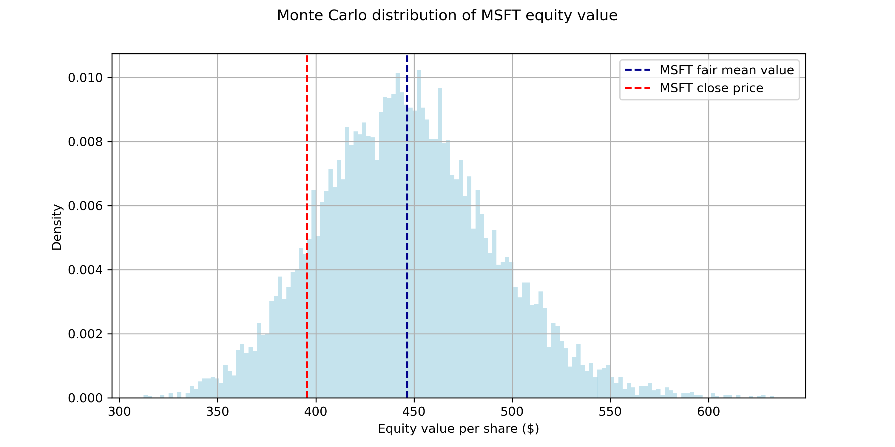

# Monte-Carlo-DCF-Valuation

Monte Carlo simulation of a Discounted Cash Flow (DCF) model to estimate the probabilistic fair value of equities using Python. The model simulates key financial drivers such as revenue growth, margins and working capital to generate a distribution of valuation outcomes.

## Example Output

The Monte Carlo simulation generates a distribution of equity values which can be compared to the current market price in order to estimate the probability of overvaluation or undervaluation.

## Methodology
 
The model follows these steps:

1. Retrieve financial data
2. Estimate historical financial ratios
3. Simulate key drivers using Monte Carlo:
   - Revenue growth
   - EBITDA margin
   - Working capital
4. Compute projected free cash flows
5. Discount cash flows using WACC
6. Estimate the distribution of equity value
